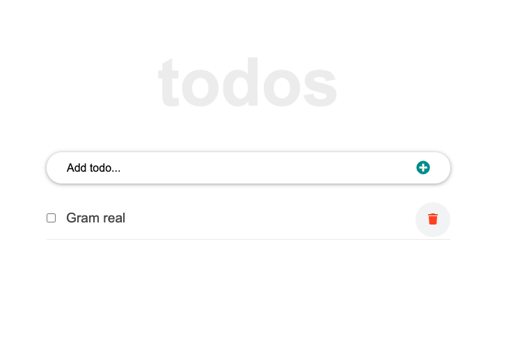

# React Todo App

> Following the React Tutorial From Scratch: [(A Step-by-Step Guide (2021)](https://ibaslogic.com/react-tutorial-for-beginners/), I developed a To do app!
This tutorial, divided into several parts, is very comprehensive, and covers all main concepts about React, from the very basics to some intermediate topics. 
> This project, is just a reinforcement of what I have learned in react so.
The tutorial is organized in the following sections:
- Part 1 - React tutorial: The beginner's guide to learning React in 2020.
- Part 2 - Working with React form and handling event.
- Part 3 – How to implement CSS in Reactjs app.
- Part 4 – How to edit to dos items.
- Part 5 – Persisting React state in local storage (Optional).
- Part 6 – Getting started with React lifecycle methods.
- Part 7 – Getting started with React hooks.
- Part 8 – How to use SVG icons in React (Optional).
- Part 9 – Routing with React Router.
- Part 10 – How to add hamburger menu in React (Optiona).
- Part 11 – Deploying React app to GitHub Pages (Optional).

## Built With 🔨

- Create React App
- JXS
- CSS
- Visual Studio Code
- Git & Github
## Deployment Live Demo

<!-- - Deployed with gh-pages
[Live Demo](https://dansam5k.github.io/LeaderBoard-APIS/) -->
### Prerequisites

- IDE to edit and run the code (We use Visual Studio Code 🔥).
- [Node.js](https://nodejs.org/en/download/) already downloaded.
- Webpack - [click here to getting started](https://webpack.js.org/guides/getting-started/).

To get a local copy up and running follow these simple example steps.

### Install

To get a local copy up and running follow these simple example steps.
- Open terminal
- Clone this project using the command `git clone https://github.com/DanSam5K/React-Todo-App.git`
- `cd <clone>` folder
- Run `npm install` to install all project dependencies
- Run `npm start` in your local browser or using Live Server in Visual Studio Code.

## Author

👤 **Daniel Samuel**

- Github: [DanSam5k](https://github.com/DanSam5k)
- Twitter: [@_dan_sam](https://twitter.com/_dan_sam)
- Linkedin: [dansamuel](https://www.linkedin.com/in/dansamuel/)
### Usage

- For anyone who wants to practice Webpack skills.
- How to manage your front-end files using Webpack.

## 🤝 Contributing

Contributions, issues, and feature requests are welcome!

Feel free to check the [issues page](https://github.com/DanSam5K/React-Todo-App/issues).

## Show your support

Give a ⭐️ if you like this project!

## Acknowledgments

- Hat tip to anyone whose code was used 🔰
- Inspiration 💘
- Microverse program ⚡
- Our standup team 🏹
- Our family's support 🙌

## 📝 License

This project is [MIT](./LICENSE) licensed.
